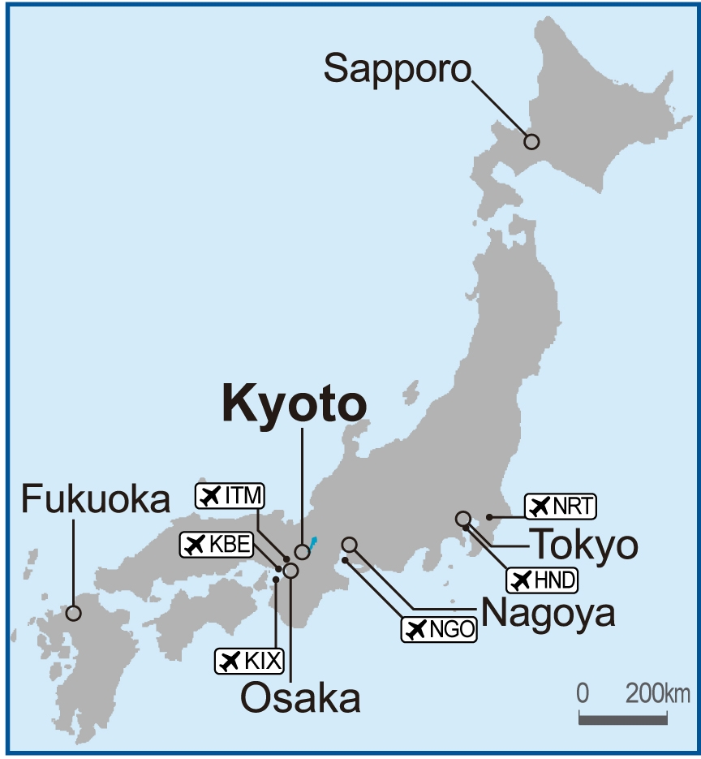

~~~
# Notorious Women of Japan
* Emmy Anthony
* Steven Anthony

## notorious...
Generally known and talked of...
The stuff of legend
        
## Hero
A person who is admired or idealized for courage, outstanding achievements, or other noble qualities.

## Notorious Women
* Mineko Iwasaki
* Sada Abe
* Sadako Sasaki
* Fictional and real folk heroines of today

## Geisha: Mineko Iwasaki (1949-)

> she left home at the age of five to begin studying traditional Japanese dance at the Iwasaki okiya (geisha house)
> She had been chosen as the house's heir. She became a maiko (apprentice geiko) at age 15. By age 16, she had earned
> a reputation as Japan's most popular maiko and finally became a geiko on her 21st birthday.

---

> Gion
> Knowledgeable insiders estimate that there are about 100 geiko and 100 maiko in Kyoto. Other cities, like Tokyo,
> have some version of geisha, but they don’t usually undergo the strict training that defines Kyoto’s maiko and geiko

## Geisha of Kyoto
* Their skills include performing various arts such as classical music, dance, games, and conversation, traditionally to entertain male customers, but also female customers today.
* Iwasaki was the most famous geiko in Japan until her sudden publicized retirement at the age of 29.

> They are NOT prostitutes, despite various silly rumors and portrayals in certain books and movies.
> Rather, they are ladies who have trained for years in the traditional Japanese arts to become
> the perfect entertainers.

## Notorious Mineko
* Sued American author _Arthur Golden_
* Iwasaki later regretted interviewing for Golden, having cited a breach of confidentiality and later sued and settled out of court with Golden for the parallelism between his book and her life.
* he later released her own autobiography titled _Geisha of Gion_ in 2002.

## Legendary
* Retired a height of career
* Moved to reform education
* Became artist

> After the death of one of her most significant mentors in 1980, Iwasaki became increasingly 
> frustrated with the tradition-bound world of the geiko, especially inadequacies in the
> education system. Iwasaki unexpectedly retired at the height of her career, at the age
> of 29. She hoped that her decision would shock Gion into reform; however, even after
> over 70 other high ranking geiko emulated her retirement, nothing was changed. In her
> autobiography, Iwasaki speculates that she may have inadvertently doomed the profession.
> She transitioned to a career in art after she married an artist named Jin'ichirō Satō
> in 1982. Their only child, Kosuke, was born in 1983.

## Sada Abe (1905-1977)

> 1930’s waitress, tea house hostess, and murderer of her lover.
> Not a true Geisha, though she entered service in a Geisha house for a period of time

## Perilous Modernity
* Shifting ideals for men and woman
* Sudden independence
* >The morality double standard

> Women could be educated almost as well as men, knowledge of the west and "modern" ideals a plus for both genders
> Women were educated and allowed to work outside the home (until marriage).
> Men were expected to flirt, date, and seduce women before marriage.
> Women were expected to befriend only other women, be modest, and virgins.

## Notorious Sada
* Remembered for strangling her lover, Kichizo Ishida , on May 18, 1936, and then cutting off his genitals and carrying them around with her in her kimono.
* Charged with second-degree murder, and mutilation of a corpse, sentenced 6 years imprisonment (commuted)

> Disappeared after interview where she expresses remorse and love for Kichizo.
> Mythology holds she became a nun and spent the rest of her life
> (died 1977 @ 66 years old) in contemplation of her mistake.

## Martyr of War

## Sadako Sasaki (1943-1955)
* August 6, 1945 - Hiroshima

> was two years old when an American atomic bomb was dropped on Hiroshima on August 6, 1945
> Sadako was at home when the explosion occurred, about 2 kilometres (1.2 mi) away
> from ground zero. She was blown out of the window and her mother ran out to find her,
> suspecting she may be dead, but instead finding her two-year-old daughter alive with
> no apparent injuries. While they were fleeing, Sadako and her mother were caught in the black rain.

---

> Several years after the atomic explosion, an increase in leukemia was observed especially
> among children. By the early 1950s, it was clear that the leukemia was caused by radiation exposure
> She was admitted as a patient to the Hiroshima Red Cross Hospital for treatment and
> blood transfusions on February 21, 1955. By the time she was admitted, her white
> blood cell count was six times higher compared with the levels of an average child.

## Cranes
Japanese legend which promises that anyone who folds one thousand origami cranes will be granted a wish - _Sadako’s wish was to live_

> In August 1955, after two days of treatment, she was moved into a room with a roommate,
> a junior high school student who was two years older than her. It was this roommate who
> told Sadako about the Japanese legend which promises that anyone who folds one thousand
> origami cranes will be granted a wish, and taught her how to fold the origami cranes.
> Although she had plenty of free time during her days in the hospital, Sadako lacked paper.
> She would use medicine wrappings and whatever else she could scrounge; this included
> going to other patients' rooms to ask to use the paper from their get-well presents.>

## 1000?
* Comes from the book _Sadako and the Thousand Paper Cranes_
* Hiroshima Peace Memorial Museum
> It is believed that she only folded 644, but father confirmed that she completed 1000,
> and was buried with them.
> The crane in Japan is one of the mystical or holy creatures (others include the dragon
> and the tortoise) and is said to live for a thousand years: That is why 1000 cranes are
> made, one for each year. In some stories it is believed that the 1000 cranes must be
> completed within one year and they must all be made by the person who is to make the wish
> at the end.

## let there be peace

## today?

        
## Anime Folk-Heroines
* Mikasa Ackerman
* Winry Rockbell
* Riza Hawkeye
* Ryuko Matoi
* Mei Tachibana
* Homura Akemi

## Mikasa Ackerman: Attack on Titan

> [STEVEN] Mikasa is the main female protoganist of Attach on Titan. She had a traumatic
> upbringing, and even though she sees the world in a synical way, she still finds the
> strength to protect her friend Eren. Her sense of duty requires her to take up arms
> against all that would harm it. She remains disciplined and level-headed.

## Winry Rockbell: Fullmetal Alchemist

> Winry is a very emotional, strong-willed and empathetic person who
> puts all her heart and effort into the things she does. Enthusiastic about machinery,
> Kindhearted, sensitive to the struggles of others.  Winry is the type of person who
> consistently tries her best to aid and support the people around her.

## Riza Hawkeye: Fullmetal Alchemist

> is an officer in the Amestrian State Military as well as the personal adjutant and
> bodyguard of Colonel Roy Mustang. A sharpshooter and firearms specialist, Lt. Hawkeye
> is an invaluable asset to the Colonel both in office and on the battlefield and serves
> as his closest and most supportive subordinate.
> Quiet, calm, collected.  The ideal soldier.  Tough love and stern.
> a stern hand and demanding nature tempered with genuine and deep affection.

## Ryuko Matoi: Kill La Kill</h3>

> [STEVEN] Ryuko is Fierce, but stubborn. She shows an unwavering loyalty to her friends,
> and her main strength is her unbreakable will. She is unafraid of death and failure is
> not an option. She fights to the death, much like the wives of samurai in the edo period.

## Mei Tachibana: Say I Love You

> She maintained a stoic persona at school and held a reputation as a "gloomy girl,"
> distancing herself from her classmates to avoid getting hurt. She gradually starts to
> become more social and grows closer to others. Despite these changes in her personality,
> Mei continues to be just as clumsy, observant, and honest as she was in the beginning of the series.
> With her newfound confidence and understanding, Mei starts to help people who are in
> situations similar to the ones she has experienced, and tries to offer advice every now
> and then. She has become more comfortable with herself, and willing to express what she has to say.

## Homura Akemi: Madoka Magica

> [STEVEN] Homura Akemi is an interesting hero. Without spoiling too much... Homura makes
> friend, and decides that she will set out on an excruciatingly painful and long process
> to save her from a great evil. Makes a promise and never gives up until she keeps it,
> even when it seems unattainable.

## Real life Folk-Heroines
* Japan women's national football team
* Chiaki Mukai
* Yoko Ono

## Japan women's national football team

> [STEVEN] The japanese womens soccer team has experienced great success in the
> world of womens soccer. Winning the 2011 Fifa world cup, Coming in 2nd in the
> 2012 Olympic games, and 2nd in the 2015 world cup. Their nickname is "nadeshiko Japan",
> which means "Ideal Japanese Women". They have inspired countless women to pursue sports.

## Chiaki Mukai

> [STEVEN] Chiaki Was the first japanese woman in space, and the first japanese
> citizen to have 2 spaceflights. She is an accomplished medical doctor, and was
> sent to space to perform experiments to test aging, and cardiovascular processes
> in zero-gravity with the late John Glenn as her test subject. She is noted as
> having boundless energy and continues to work with the japanese public to get
> them interested in space.

## Yoko Ono

> Impossible not to talk about.  Credited with Lennon’s creative bursts, or the breakup of
> the Beatles.  WHatever you believe she was an artist and designer in her own right.
> As well as a poet and musician.
> Ono grew up in Tokyo and studied at Gakushuin. She withdrew from her course after two
> years and rejoined her family in New York in 1953.
> She first met Lennon in 1966 at her own art exhibition in London, and they became a couple
> in 1968. With their performance Bed-Ins for Peace in Amsterdam and Montreal in 1969, Ono
> and Lennon famously used their honeymoon at the Hilton Amsterdam as a stage for public protests
> against the Vietnam War
> Public appreciation of Ono's work has shifted over time, helped by a retrospective at a Whitney
> Museum branch in 1989 and the 1992 release of the six-disc box set Onobox.
> As Lennon's widow, Ono works to preserve his legacy. She funded Strawberry Fields in Manhattan's
> Central Park, the Imagine Peace Tower in Iceland, and the John Lennon Museum in Saitama, Japan
> (which closed in 2010). She has made significant philanthropic contributions to the arts, peace,
> Philippine and Japan disaster relief, and other causes.

## Questions?

